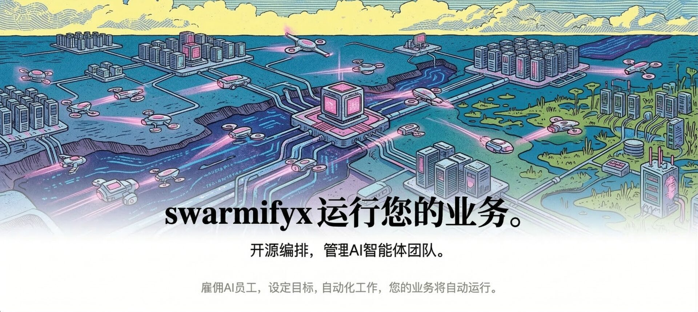

<p align="center">
  
</p>

<p align="center">
  <a href="#quickstart"><strong>快速开始</strong></a> &middot;
  <a href="__KEEP_PAPERTAPE_COM_DOCS__"><strong>文档</strong></a> &middot;
  <a href="https://github.com/papertapeai/papertape"><strong>GitHub</strong></a> &middot;
  <a href="https://discord.gg/m4HZY7xNG3"><strong>Discord</strong></a>
</p>

<p align="center">
  <a href="https://github.com/papertapeai/papertape/blob/master/LICENSE"></a>
  <a href="https://github.com/papertapeai/papertape/stargazers"></a>
  <a href="README.md"></a>
  <a href="https://discord.gg/m4HZY7xNG3"></a>
</p>

<br/>

<div align="center">
  <video src="https://github.com/user-attachments/assets/773bdfb2-6d1e-4e30-8c5f-3487d5b70c8f" width="600" controls></video>
</div>

<br/>

> 基于 paperclip fork，MIT 协议。

## Papertape 是什么？

# 面向"零人类公司"的开源编排系统

**如果 OpenClaw 是_员工_，Papertape 就是_公司_**

Papertape 提供一个 Node.js 后端 + React 控制面板，用于管理并运转一支 AI 代理团队。你接入自己的代理、分配目标，在一个控制台里追踪所有工作进度和成本。

它外观像个任务管理器，但内部有完整的组织架构、预算管控、治理流程、目标对齐和代理协调机制。

**管理业务目标，而不是 PR。**

|        | 步骤     | 示例                                                       |
| ------ | -------- | ---------------------------------------------------------- |
| **01** | 定义目标 | _"打造排名第一的 AI 笔记应用，MRR 做到 $1M。"_            |
| **02** | 组建团队 | CEO、CTO、工程师、设计师、市场——任何机器人，任何平台。    |
| **03** | 审批运行 | 审核策略，设定预算，点击运行，从控制台监控。               |

<br/>

> **即将推出：Clipmart** — 一键下载并运行整家公司。浏览预置的公司模板（完整组织架构、代理配置和技能），几秒内导入你的 Papertape 实例。

<br/>

<div align="center">
<table>
  <tr>
    <td align="center"><strong>兼容<br/>代理</strong></td>
    <td align="center"><br/><sub>OpenClaw</sub></td>
    <td align="center"><br/><sub>Claude Code</sub></td>
    <td align="center"><br/><sub>Codex</sub></td>
    <td align="center"><br/><sub>Cursor</sub></td>
    <td align="center"><br/><sub>Bash</sub></td>
    <td align="center"><br/><sub>HTTP</sub></td>
  </tr>
</table>

<em>只要能接收心跳，就能被录用。</em>

</div>

<br/>

## 你适合用 Papertape，如果你…

- ✅ 想要打造**全自动 AI 公司**
- ✅ 需要把**多种不同代理**（OpenClaw、Codex、Claude、Cursor）统一协调到一个目标下
- ✅ 同时开着 **20 个 Claude Code 终端**，完全不知道每个在做什么
- ✅ 想让代理 **24/7 自主运转**，但需要时还能审查和介入
- ✅ 想**监控成本**并强制执行预算上限
- ✅ 想要一套管理代理**像任务管理器一样顺手**的流程
- ✅ 想在**手机上**管理你的自动化企业

<br/>

## 核心特性

<table>
<tr>
<td align="center" width="33%">
<h3>🔌 自带代理，自由接入</h3>
任何代理，任何运行时，一套组织结构。只要能接收心跳，就能被录用。
</td>
<td align="center" width="33%">
<h3>🎯 目标对齐</h3>
每个任务都能追溯回公司使命。代理知道<em>该做什么</em>，也知道<em>为什么</em>。
</td>
<td align="center" width="33%">
<h3>💓 心跳与委派</h3>
代理按计划唤醒，检查队列，然后行动。任务沿组织结构上下委派。
</td>
</tr>
<tr>
<td align="center">
<h3>💰 成本管控</h3>
为每个代理设置月度预算，超限自动停止。没有失控的账单。
</td>
<td align="center">
<h3>🏢 多公司隔离</h3>
一套部署，多家公司，数据完全隔离。一个控制台管理所有业务。
</td>
<td align="center">
<h3>🎫 工单追踪</h3>
所有对话有记录，所有决策有解释。完整的工具调用链路和不可篡改的审计日志。
</td>
</tr>
<tr>
<td align="center">
<h3>🛡️ 治理机制</h3>
你是董事会。随时可以审批招聘、推翻策略、暂停或终止任何代理。
</td>
<td align="center">
<h3>📊 组织架构</h3>
有层级、有角色、有汇报关系。你的代理有上司、有职位、有职责描述。
</td>
<td align="center">
<h3>📱 移动端支持</h3>
随时随地监控和管理你的自动化企业。
</td>
</tr>
</table>

<br/>

## Papertape 解决的痛点

| 没有 Papertape 时                                                                                    | 用了 Papertape 之后                                                                                     |
| ---------------------------------------------------------------------------------------------------- | ------------------------------------------------------------------------------------------------------- |
| ❌ 开着 20 个 Claude Code 标签，根本记不清谁在做什么，重启之后全部丢失。                           | ✅ 任务以工单形式存在，对话有线程记录，会话跨重启持久保存。                                           |
| ❌ 每次都要手动从各处拼凑上下文，才能让机器人知道你在干什么。                                       | ✅ 上下文从任务向上穿透项目和公司目标——代理始终清楚该做什么、为什么做。                               |
| ❌ 代理配置文件散落各处，重新发明任务管理、沟通协调的轮子。                                         | ✅ Papertape 开箱即提供组织架构、工单、委派和治理——管的是公司，不是一堆脚本。                        |
| ❌ 失控的循环在你毫不知情的情况下烧掉几百块的 token 并耗尽配额。                                   | ✅ 成本追踪实时显示 token 余额，超限自动节流，管理层用预算决定优先级。                               |
| ❌ 周期性任务（客服、社媒、报告）每次都要人工手动触发。                                             | ✅ 心跳按计划自动处理周期性工作，管理层负责监督。                                                     |
| ❌ 每次有想法，都要找到仓库、启动 Claude Code、开着标签页盯着它。                                  | ✅ 在 Papertape 里新建一个任务，代理会一直工作到完成，管理层负责审阅成果。                           |

<br/>

## 为什么 Papertape 不一样

Papertape 把那些棘手的编排细节处理对了。

|                          |                                                                                         |
| ------------------------ | --------------------------------------------------------------------------------------- |
| **原子性执行**           | 任务检出和预算执行是原子操作，不会重复干活，也不会超支。                               |
| **代理状态持久化**       | 代理在每次心跳之间延续同一个任务上下文，而不是从头开始。                               |
| **运行时技能注入**       | 代理可以在运行时学习 Papertape 的工作流和项目上下文，无需重新训练。                   |
| **可回滚的治理机制**     | 审批卡点强制执行，配置变更有版本记录，出问题的变更可以安全回滚。                       |
| **目标感知执行**         | 任务携带完整的目标祖先链，代理始终能看到"为什么"，而不只是一个标题。                 |
| **可移植的公司模板**     | 导出/导入组织、代理和技能，自动处理密钥脱敏和命名冲突。                               |
| **真正的多公司隔离**     | 每个实体都严格归属于某家公司，一个部署可以运行多家公司，各自有独立的数据和审计日志。 |

<br/>

## Papertape 不是什么

|                        |                                                                                               |
| ---------------------- | --------------------------------------------------------------------------------------------- |
| **不是聊天机器人**     | 代理有工作要做，不是用来聊天的。                                                             |
| **不是代理框架**       | 我们不管你怎么构建代理，我们管的是怎么让它们组成一家公司运转起来。                         |
| **不是工作流搭建器**   | 没有拖拽连线的流程图。Papertape 建模的是公司——有组织架构、目标、预算和治理。               |
| **不是 Prompt 管理器** | 代理自带提示词、模型和运行时。Papertape 管理的是它们所在的组织。                           |
| **不是单代理工具**     | 这是为团队设计的。如果你只有一个代理，可能用不上。如果你有二十个——一定用得上。            |
| **不是代码审查工具**   | Papertape 编排的是工作，不是 PR。代码审查流程请自行接入。                                   |

<br/>

## 快速开始

开源，自托管，不需要注册 Papertape 账号。

```bash
npx papertape onboard --yes
```

或手动从源码启动：

```bash
git clone https://github.com/papertapeai/papertape.git
cd papertape
pnpm install
pnpm dev
```

API 服务启动在 `http://localhost:3100`，内置 PostgreSQL 自动创建，无需额外配置。

> **环境要求：** Node.js 20+，pnpm 9.15+

<br/>

## 常见问题

**典型的部署方式是什么？**
本地开发时，一个 Node.js 进程管理嵌入式 Postgres 和本地文件存储。生产环境直接接你自己的 Postgres，按需部署。配置好项目、代理和目标之后，剩下的交给代理自己跑。

如果是独立开发者，可以用 Tailscale 在外出时访问本地的 Papertape，之后有需要再迁移到 Vercel 等云平台。

**能同时运行多家公司吗？**
可以。一个部署可以运行任意数量的公司，数据完全隔离。

**Papertape 和 OpenClaw、Claude Code 这类代理工具有什么区别？**
Papertape _使用_ 那些代理。它把它们编排成一家公司——有组织架构、预算、目标、治理和问责机制。

**为什么不直接把 OpenClaw 接到 Asana 或 Trello？**
代理编排有很多细节需要处理：谁锁定了哪个任务、如何维护会话状态、成本怎么监控、治理怎么落地——Papertape 把这些全部处理好了。

（支持接入自定义工单系统已在路线图中。）

**代理会持续运行吗？**
默认情况下，代理在计划心跳和事件触发（任务分配、@提及等）时运行。你也可以接入像 OpenClaw 这样的常驻代理。你负责提供代理，Papertape 负责协调。

<br/>

## 开发

```bash
pnpm dev              # 完整开发模式（API + UI，watch 模式）
pnpm dev:once         # 完整开发模式（不启用文件监听）
pnpm dev:server       # 仅启动服务端
pnpm build            # 全量构建
pnpm typecheck        # 类型检查
pnpm test:run         # 运行测试
pnpm db:generate      # 生成数据库迁移
pnpm db:migrate       # 应用迁移
```

完整开发文档见 [doc/DEVELOPING.md](doc/DEVELOPING.md)。

<br/>

## 路线图

- ⚪ 优化 OpenClaw 的接入体验
- ⚪ 支持云端代理，如 Cursor / e2b agents
- ⚪ ClipMart — 买卖整套代理公司模板
- ⚪ 简化代理配置，降低上手门槛
- ⚪ 更好的测试框架支持
- ⚪ 插件系统（知识库、自定义追踪、队列等）
- ⚪ 完善文档

<br/>

## 贡献

欢迎贡献。详见 [CONTRIBUTING.md](CONTRIBUTING.md)。

<br/>

## 社区

- [Discord](https://discord.gg/m4HZY7xNG3) — 加入社区
- [GitHub Issues](https://github.com/papertapeai/papertape/issues) — 报 bug 和功能请求
- [GitHub Discussions](https://github.com/papertapeai/papertape/discussions) — 想法和 RFC

<br/>

## 许可证

MIT &copy; 2026 Papertape

## Star 历史

[](https://www.star-history.com/?repos=cjc-x%2Fpapertape&type=date&legend=top-left)

<br/>

---

<p align="center">
  
</p>

<p align="center">
  <sub>MIT 开源。为那些想尽情经营公司、而不是当 AI 保姆的人设计。</sub>
</p>
